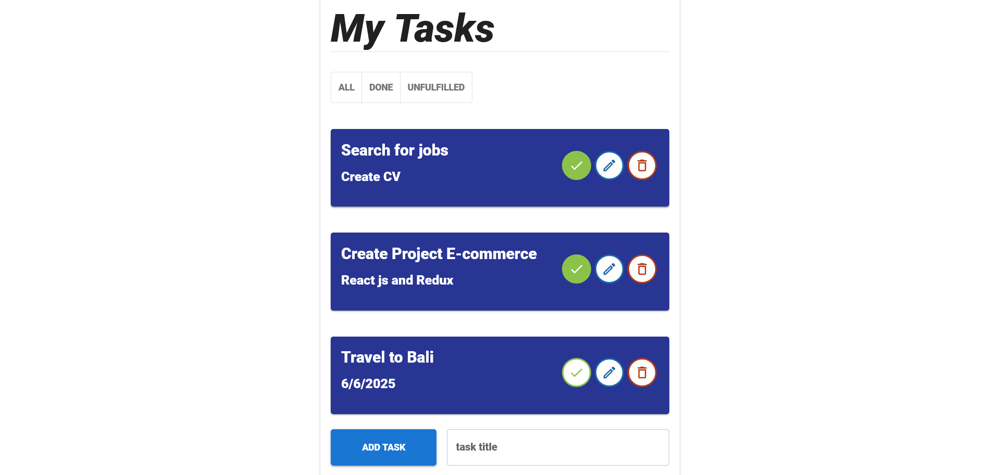

# React To-Do List Application

## Overview

The React To-Do List application is a task management tool built with React that utilizes **Local Storage** for efficient data handling. By avoiding external APIs, this application ensures high performance and a seamless user experience with well-structured, extensible code.



## Features

### 1. Clean and Organized Structure
- **Functional Components**: Utilizes React functional components with Hooks such as `useState` and `useEffect` for effective state management and lifecycle handling.

### 2. Data Management with Local Storage
- **Persistent Data**: Tasks are saved and retrieved from Local Storage to ensure data persistence even after closing the application or refreshing the page.
- **Immediate Sync**: Uses `useEffect` to synchronize data with Local Storage instantly upon adding, editing, or deleting tasks.

### 3. Enhanced Performance
- **Optimized Rendering**: Reduces unnecessary re-renders using `React.memo` to prevent re-rendering components that haven’t changed.
- **Virtual DOM**: Effectively leverages Virtual DOM to ensure quick and efficient updates to the interface with minimal performance overhead.

### 4. Improved User Experience
- **Material UI**: Incorporates Material UI framework for a modern and responsive design, enhancing user experience across various devices and screen sizes.

### 5. Code Security and Stability
- **Best Practices**: Follows best practices such as using PropTypes for type checking and ESLint for maintaining code quality and avoiding common errors.
- **Continuous Testing**: Ensures application stability with continuous testing using tools like Jest and React Testing Library before release.

## Installation

To get started with the React To-Do List application, clone the repository and install the dependencies:

```bash
git clone https://github.com/mohammed-bakkali/Todo-List-React-js.git
cd Todo-List-React-js
npm install
npm start
